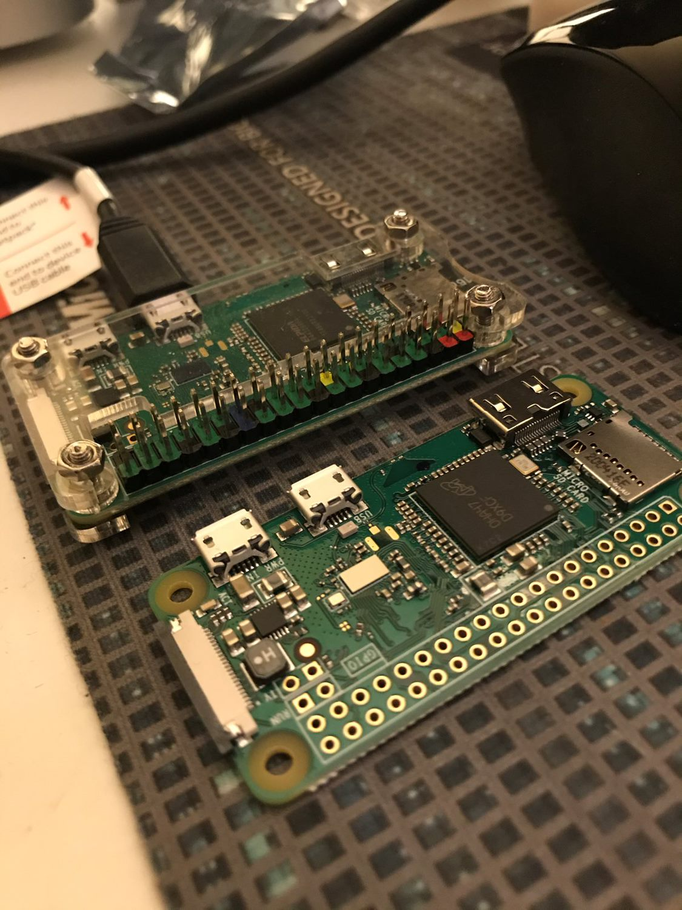

# Busy Light Indicator for Teams
Raspberry Pi 0/3/4 - connected to a RGB light. Color of light reflects Teams status (busy, free, away, presenting etc.)
A small LCD panel is also connected which shows a short message to re-enforce the light color.

This approach was devised to avoid the need for access and permissions to MS Graph to directly query the status. In many enterprises, it is difficult to get access to this property from a AAD Client Application.

There are two parts to the application:
1. Python API running on the RP3 that waits for status messages from the PC (teamslight.py).
2. Python utility on the PC that tracks the Teams status via the Teams log file, and calls the API accordingly (teamslogwatch.py).

> Note that this approach of scraping the Teams log file for status updates, only works on Windows. If you know of a way to make this work on the Mac version of Teams, please submit a PR.

> It is assumed that the RPi is on the same network as the laptop running teams, or at least you can connect from the laptop to the RPi.

LCD panel: https://www.amazon.com/gp/product/B072Q2X2LL

RGB Module: https://www.amazon.com/Colour-Module-Color-tri-Color-Arduino/dp/B07KNTTQ1M/

Installation of Python libraries for using the LCD panel: https://learn.adafruit.com/monochrome-oled-breakouts/python-setup  

Next step is to migrate the connections and SD card to the Raspberry Pi Zero to make the installation cheaper and sleeker. Then I can use the RPi3 for my next project!

