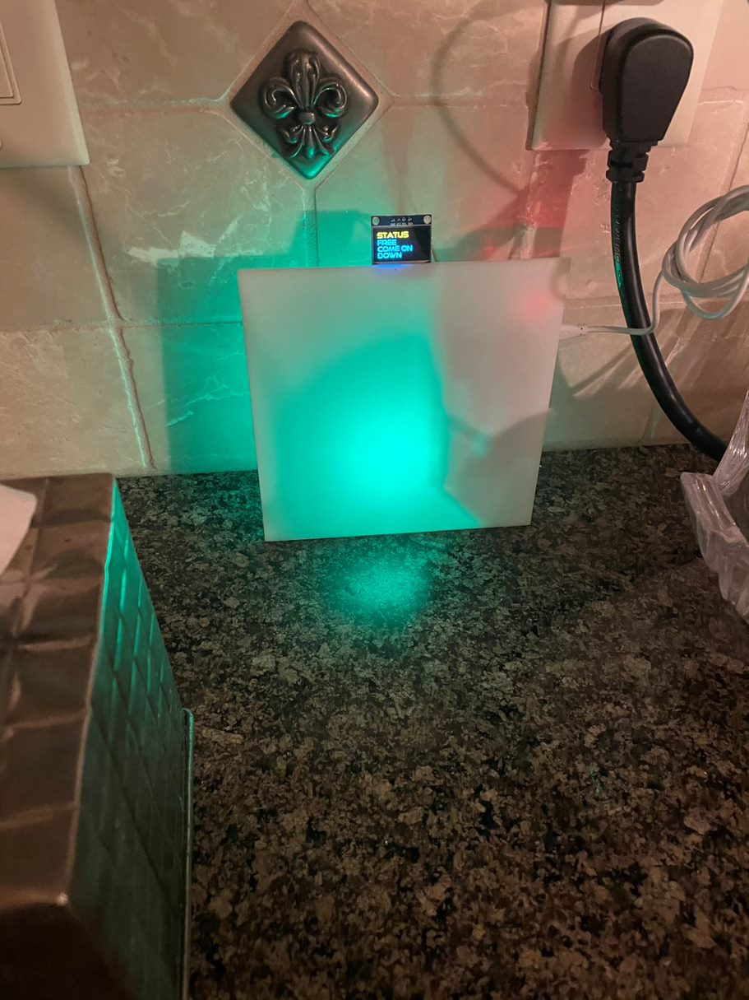

# Busy Light Indicator for Teams
Raspberry Pi 0/3/4 - connected to a RGB light. Color of light reflects Teams status (busy, free, away, presenting etc.)
A small LCD panel is also connected which shows a short message to re-enforce the light color.

There are two parts to the application:
1. Python API running on the RP3 that waits for status messages fromt he PC (teamslight.py).
2. Python utility on the PC that tracks the Teams status via the Teams log file, and calls the API accordingly (teamslogwatch.py).

